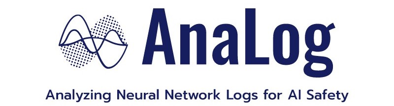

<p align="center">
  <a href="https://github.com/sangkeun00/analog/">
    
  </a>
</p>

<div align="center">

  [](#build-pipeline-status)
  [](https://github.com/leopard-ai/betty/blob/main/LICENSE)
  <a href="https://github.com/psf/black"></a>
  
</div>

```bash
git clone https://github.com/sangkeun00/analog.git; cd analog; pip install . # Install
```

## Usage
AnaLog is designed with the belief that diverse logs generated by neural networks, such as
gradient and activation, can be utilized for analyzing and debugging data, algorithms,
and other aspects. To use AnaLog, users simply adhere to a two-stage workflow:

1. **Logging**: Extract and save various logs (e.g. per-sample gradient, activation) to disk.
2. **Analysis**: Load logs from disk and perform custom analysis (e.g. influence function).

### Logging
Logging with AnaLog is as simple as adding one `with` statement to the existing
training code. AnaLog automatically extracts user-specified logs using PyTorch hooks, and
saves it to disk using a memory-mapped file.

```python
from analog import AnaLog

analog = AnaLog(project="my_project") # initialze AnaLog
analog.update({"log": ["grad"], "hessian": True, "save": True}) # set logging config
analog.watch(model) # add your model to log

for input, target in data_loader:
    with analog(data_id=input): # set data_id for the log from the current batch
        out = model(input)
        loss = loss_fn(out, target, reduction="sum")
        loss.backward()
        model.zero_grad()
analog.finalize() # finalize logging
```

### Analysis
Once logging is completed, the user can simply load them from disk, and perform any
analysis the user may want. We have currently implemented influence function, which can be used
for both training data attribution and uncertainty quantification for AI safety.

```python
from analog.analysis import InfluenceFunction

analog.eval() # enter analysis mode
log_loader = analog.build_log_dataloader() # return PyTorch DataLoader for log data

with analog():
    test_out = model(test_input)
    test_loss = loss_fn(test_out, test_target, reduction="sum")
    test_loss.backward()
test_log = analog.get_log() # extract a log for test data

analog.add_analysis({"influence": InfluenceFunction}) # add your custom analysis

analog.influence.compute_influence_all(test_log, log_loader) # data attribution
analog.influence.compute_self_influence(test_log) # uncertainty
```

Please check out [Examples](/examples) for more advanced features!

## Features
Logs from neural networks are difficult to handle due to the large size. For example,
the size of the gradient of *each* training datapoint is about as large as the whole model. Therefore,
we provide various systems support to efficiently scale neural network analysis to
billion-scale models. Below are a few features that AnaLog currently supports: 

- **Gradient compression** (compression ratio: 1,000-100,000x)
- **Memory-map-based data IO**
- **CPU offloading of logs**

## Compatability
| DistributedDataParallel| Mixed Precision| Gradient Checkpointing | torch.compile  | FSDP           |
|:----------------------:|:--------------:|:----------------------:|:-------------:|:--------------:|
| ✅                     | ✅             | ✅                    | ✅           |   ❓             |

## Contributing

We welcome contributions from the community. Please see our [contributing
guidelines](CONTRIBUTING.md) for details on how to contribute to AnaLog.

## Citation
To cite this repository:

```
@software{analog2024github,
  author = {Sang Keun Choe, Hwijeen Ahn, Juhan Bae, Minsoo Kang, Youngseog Chung, Kewen Zhao},
  title = {{AnaLog}: Scalable Logging and Analysis Tool for Neural Networks},
  url = {http://github.com/sangkeun00/analog},
  version = {0.0.1},
  year = {2024},
}
```

## License
AnaLog is licensed under the [Apache 2.0 License](LICENSE).
