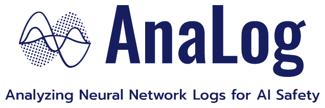

<p align="center">
  <a href="https://https://github.com/sangkeun00/analog/">
    
  </a>
</p>

<div align="center">

  [](#build-pipeline-status)
  [](https://github.com/leopard-ai/betty/blob/main/LICENSE)
  <a href="https://github.com/psf/black"></a>
  
</div>

```bash
pip install betty-ml
```

### What is AnaLog?
AnaLog is a scalable and interoperable machine learning debugging tool. It's built upon the asssumption that training logs (e.g. activations) have rich information about the final model, so debugging can be facilitated by analyzing these logs.

### How to use?
1. **Log** gradient-related statistics (e.g. gradient, activation)
2. **Analyze** log

### Logging
```python
import torch
import torch.nn.functional as F
from datasets import load_dataset
from analog import AnaLog

model = torch.nn.Transformer().to(device)
optimizer = torch.optim.Adam(model.parameters())
dataset = load_dataset('my_dataset')
data = torch.utils.data.DataLoader(dataset, shuffle=True)

##############################################################
### Logging is as easy as adding one `with` statement line ###
##############################################################
analog = AnaLog(project="analog")
analog.watch(model)
for input, target in data_loader:
    with analog(data_id=input, log=["forward", "backward"], hessian=True, save=True):
        out = model(input)
        loss = loss_fn(out, target)
        loss.backward()
        model.zero_grad()
analog.finalize()
```

### Analysis
```python
# debug test data
with analog(log=["forward", "backward"], test=True) as al:
    test_out = model(test_input)
    test_loss = loss_fn(test_out, test_target)
    test_loss.backward()
    test_log = al.get_log()

# add preferred analysis plugins (e.g. influence function)
from analog.analysis import InfluenceFunction

analog.add_analysis({"influence": InfluenceFunction})

analog.infleunce.compute_influence(test_log, train_log)
analog.influence.compute_influence_all(test_log)
analog.influence.compute_self_influence(test_log)
```
